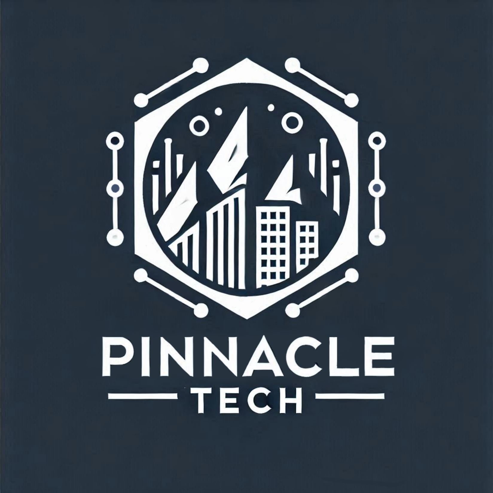

<!DOCTYPE html>
<html lang="en">
<head>
    <meta charset="UTF-8">
    <meta name="viewport" content="width=device-width, initial-scale=1.0">
    <title>EdgeHub Marketing</title>
    <link href="https://cdnjs.cloudflare.com/ajax/libs/tailwindcss/2.2.19/tailwind.min.css" rel="stylesheet">
    
</head>
<body>
    <!-- Header -->
    <header class="header flex justify-between items-center">
        <h1 class="text-2xl font-bold">EdgeHub Marketing</h1>
        <nav>
            <a href="#home">Home</a>
            <a href="#services">Services</a>
            <a href="#portfolio">Portfolio</a>
            <a href="#about">About</a>
            <a href="#contact">Contact Us</a>
        </nav>
    </header>

    <!-- Home Section -->
    <section id="home" class="section bg-gray-100">
        <h2>Welcome to EdgeHub Marketing</h2>
        
Where creativity meets precision for all your marketing needs.

    </section>

    <!-- Services Section -->
    <section id="services" class="section">
        <h2>Our Services</h2>
        

            

                <h3 class="text-xl font-semibold">Graphic Design</h3>
                
Crafting visually stunning logos, banners, and graphics.

            

            

                <h3 class="text-xl font-semibold">Copywriting</h3>
                
Engaging content that drives sales and engagement.

            

            

                <h3 class="text-xl font-semibold">Content Writing</h3>
                
Informative blogs and articles tailored to your audience.

            

            

                <h3 class="text-xl font-semibold">Website Development</h3>
                
Responsive, visually appealing, and functional websites.

            

        

    </section>

    <!-- Portfolio Section -->
    <section id="portfolio" class="section bg-gray-100">
        <h2>Portfolio</h2>
        

            <!-- Project 1 -->
            

                
                

                    <h3 class="text-xl font-semibold">Pinnacle Tech</h3>
                    
A corporate logo design for a futuristic tech company.

                

            

            <!-- Project 2 -->
            

                
                

                    <h3 class="text-xl font-semibold">Aurora Botanicals</h3>
                    
A minimalistic logo design for an organic beauty brand.

                

            

            <!-- Project 3: Resapi -->
            

                
                

                    <h3 class="text-xl font-semibold">Resapi</h3>
                    
A branding and identity project for Resapi, a volunteer initiative dedicated to providing psychological first aid and mental health support..

                

            

        

    </section>

    <!-- About Section -->
    <section id="about" class="section">
        <h2>About Us</h2>
        
At EdgeHub Marketing, we are passionate about delivering innovative marketing solutions tailored to your brand's unique needs.

    </section>

    <!-- Contact Section -->
    <section id="contact" class="section bg-gray-100">
        <h2>Contact Us</h2>
        
Get in touch with us for any inquiries or collaboration opportunities.

        
Email: <a href="mailto:edgehubmarketing@gmail.com" class="text-blue-500">edgehubmarketing@gmail.com</a>

    </section>

    <!-- Footer -->
    <footer class="footer">
        
© 2025 EdgeHub Marketing. All rights reserved.

    </footer>
</body>
</html>
